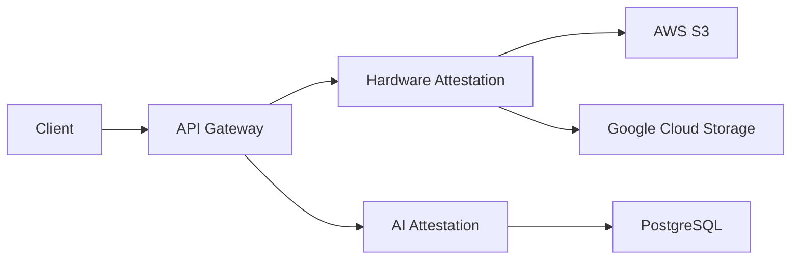

# LotaBots Platform Architecture

## System Overview

The LotaBots platform is designed as a microservices architecture focusing on AI model and hardware attestation. The system is built with security, scalability, and reliability as core principles.

## Core Services

### Hardware Attestation Service

#### Purpose

Provides hardware verification and attestation for GPU and specialized AI hardware.

#### Key Components

1. **Container Management**

   - Secure container creation and lifecycle management
   - GPU device allocation and isolation
   - Security policy enforcement
   - Mount point validation

2. **Storage Integration**

   - AWS S3 primary storage
   - Google Cloud Storage backup
   - Encrypted data transfer
   - Audit logging

3. **Hardware Verification**
   - NVIDIA GPU capability detection
   - MIG profile management
   - Hardware security validation
   - Resource monitoring

### AI Attestation Service

#### Purpose

Manages AI model verification, compliance, and behavioral attestation.

#### Key Components

1. **API Layer**

   - RESTful endpoints
   - Authentication/Authorization
   - Rate limiting
   - Request validation

2. **Database Layer**

   - PostgreSQL for persistent storage
   - Connection pooling
   - Query optimization
   - Data encryption

3. **Business Logic**
   - Model verification
   - Compliance checking
   - Audit trail generation
   - Policy enforcement

## Technical Architecture

### Data Flow



### Security Architecture

1. **Edge Security**

   - TLS termination
   - DDoS protection
   - WAF rules
   - Rate limiting

2. **Service Security**

   - JWT authentication
   - Service mesh encryption
   - RBAC enforcement
   - Audit logging

3. **Data Security**
   - Encryption at rest
   - Encryption in transit
   - Key rotation
   - Access control

## Infrastructure

### Development Environment

- Local development with Docker
- Minikube for Kubernetes testing
- Mock services for external dependencies
- Development-specific configurations

### Production Environment

1. **Compute**

   - Kubernetes cluster
   - GPU-enabled nodes
   - Auto-scaling groups
   - Load balancing

2. **Storage**

   - PostgreSQL clusters
   - S3 buckets
   - GCS buckets
   - Backup systems

3. **Monitoring**
   - OpenTelemetry integration
   - Metrics collection
   - Distributed tracing
   - Log aggregation

## Development Practices

### Code Organization

```
services/
├── hardware-attestation/
│   ├── src/
│   │   ├── core/          # Core business logic
│   │   ├── api/           # API endpoints
│   │   ├── storage/       # Storage integration
│   │   └── models/        # Data models
│   └── tests/             # Test suites
└── ai-attestation/
    ├── src/
    │   ├── api/           # API endpoints
    │   ├── config/        # Configuration
    │   ├── models/        # Data models
    │   └── services/      # Business services
    └── tests/             # Test suites
```

### Testing Strategy

1. **Unit Tests**

   - Business logic validation
   - Model verification
   - Security checks
   - Error handling

2. **Integration Tests**

   - API endpoints
   - Database operations
   - External services
   - Security features

3. **Performance Tests**
   - Load testing
   - Stress testing
   - Scalability validation
   - Resource utilization

## Deployment

### CI/CD Pipeline

1. **Build Stage**

   - Code compilation
   - Unit tests
   - Security scanning
   - Docker image building

2. **Test Stage**

   - Integration tests
   - Performance tests
   - Security tests
   - Compliance checks

3. **Deploy Stage**
   - Canary deployment
   - Blue-green deployment
   - Rollback capability
   - Monitoring verification

## Future Considerations

### Scalability

- Horizontal scaling of services
- Database sharding
- Caching layers
- Load distribution

### Reliability

- Circuit breakers
- Retry mechanisms
- Fallback strategies
- Disaster recovery

### Security

- Zero-trust architecture
- Enhanced encryption
- Hardware security modules
- Compliance automation
