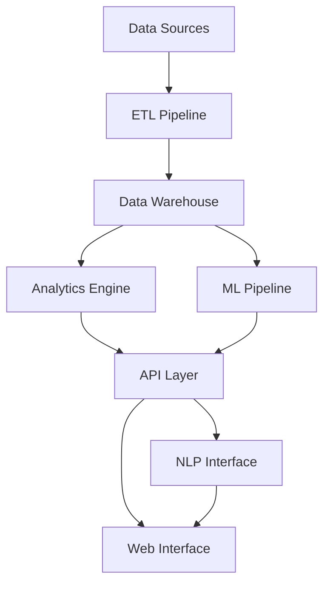
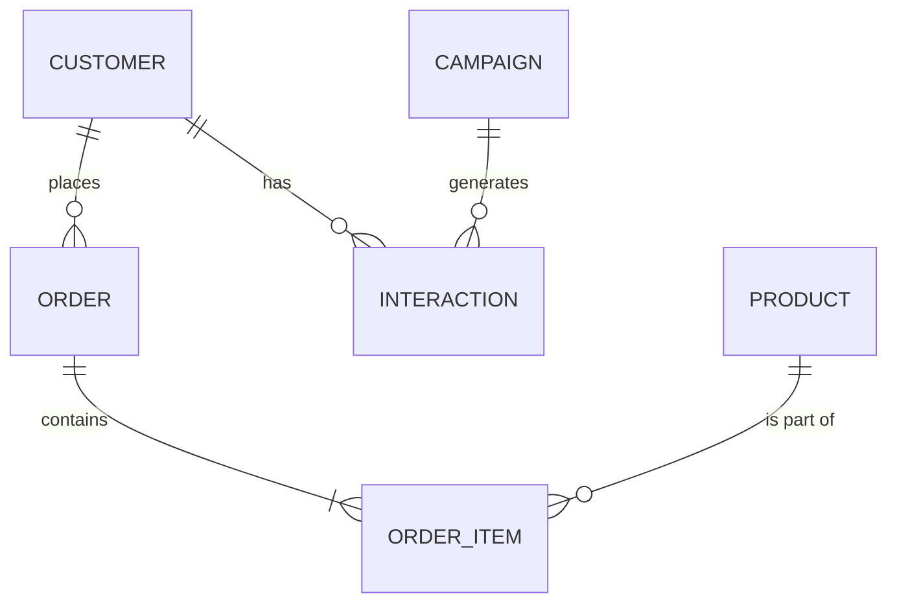

# Business Intelligence and AI-Driven Advisory System Design

## System Overview

This document outlines the architecture and implementation details for a comprehensive Business Intelligence (BI) and AI-driven advisory system that integrates multiple data sources to provide actionable insights and strategic recommendations.

## 1. System Architecture

### 1.1 High-Level Components

### 1.2 Core Components

#### Data Layer
- **Data Warehouse**: Snowflake
  - Scalable storage
  - Support for structured and semi-structured data
  - Built-in data sharing capabilities
- **Data Lake**: Azure Data Lake Storage Gen2
  - Raw data storage
  - Support for unstructured data
  - Cost-effective long-term storage

#### Processing Layer
- **ETL Pipeline**: Apache Airflow + dbt
  - Orchestration of data pipelines
  - SQL-first transformations
  - Version control for transformations
- **Stream Processing**: Apache Kafka + ksqlDB
  - Real-time data ingestion
  - Stream processing capabilities
  - Event-driven architecture

#### Analytics Layer
- **BI Engine**: Apache Superset
  - Interactive dashboards
  - SQL Lab for ad-hoc analysis
  - Rich visualization library
- **ML Pipeline**: MLflow
  - Model training and versioning
  - Experiment tracking
  - Model deployment

#### API Layer
- **FastAPI**
  - High performance
  - Automatic API documentation
  - Type safety
- **GraphQL API**
  - Flexible data querying
  - Reduced network overhead
  - Strong typing

#### Frontend Layer
- **Next.js + React**
  - Server-side rendering
  - Component-based architecture
  - Rich ecosystem
- **D3.js + Apache ECharts**
  - Custom visualizations
  - Interactive charts
  - Real-time updates

## 2. Data Integration and Processing

### 2.1 ETL Process
1. **Extraction**
   - REST API connectors for CRM and marketing platforms
   - Database connectors for operational databases
   - File parsers for CSV/Excel imports

2. **Transformation**
   - Data cleaning (missing values, outliers)
   - Data type standardization
   - Feature engineering
   - Business logic application

3. **Loading**
   - Incremental loading
   - Data quality checks
   - Schema evolution handling

### 2.2 Data Model

## 3. Analytics and ML Pipeline

### 3.1 Key Analytics Components
- **Descriptive Analytics**
  - KPI calculations
  - Trend analysis
  - Cohort analysis

- **Predictive Analytics**
  - Sales forecasting (Prophet)
  - Churn prediction (XGBoost)
  - Customer LTV prediction

- **Prescriptive Analytics**
  - Optimization models
  - What-if analysis
  - Scenario planning

### 3.2 ML Models
1. **Customer Segmentation**
   - Algorithm: K-means clustering
   - Features: behavioral, demographic, transactional
   - Update frequency: weekly

2. **Churn Prediction**
   - Algorithm: Gradient Boosting
   - Features: engagement metrics, purchase history
   - Update frequency: daily

3. **Price Optimization**
   - Algorithm: Reinforcement Learning
   - Features: demand, competition, costs
   - Update frequency: real-time

## 4. Natural Language Interface

### 4.1 Query Processing Pipeline
1. **Intent Recognition**
   - BERT-based classification
   - Custom intent categories
   - Confidence scoring

2. **Entity Extraction**
   - Named Entity Recognition (spaCy)
   - Custom entity types
   - Context resolution

3. **Query Generation**
   - SQL generation
   - Natural language responses
   - Visualization suggestions

## 5. Security and Compliance

### 5.1 Security Measures
- End-to-end encryption
- Role-based access control
- Audit logging
- Data masking

### 5.2 Compliance
- GDPR compliance
- CCPA compliance
- SOC 2 compliance
- Data retention policies

## 6. Scalability and Performance

### 6.1 Scalability Measures
- Horizontal scaling
- Caching strategy
- Load balancing
- Database sharding

### 6.2 Performance Optimization
- Query optimization
- Materialized views
- Data partitioning
- Index strategy

## 7. Monitoring and Maintenance

### 7.1 System Monitoring
- Prometheus + Grafana
- Custom metrics
- Alerting rules
- Performance dashboards

### 7.2 Maintenance Procedures
- Backup strategy
- Disaster recovery
- Update procedures
- Testing protocols

## 8. Implementation Plan

### Phase 1: Foundation (Weeks 1-4)
- Set up data warehouse
- Implement basic ETL pipelines
- Create data model
- Set up monitoring

### Phase 2: Core Analytics (Weeks 5-8)
- Implement BI dashboards
- Deploy basic ML models
- Create API endpoints
- Develop frontend

### Phase 3: Advanced Features (Weeks 9-12)
- Implement NLP interface
- Deploy advanced ML models
- Add prescriptive analytics
- Security hardening

### Phase 4: Optimization (Weeks 13-16)
- Performance tuning
- Scale testing
- User acceptance testing
- Documentation and training

## 9. Success Metrics

### 9.1 Technical Metrics
- System uptime: 99.9%
- Query response time: <500ms
- ML model accuracy: >85%
- API availability: 99.99%

### 9.2 Business Metrics
- User adoption rate
- Time saved in analysis
- Accuracy of predictions
- ROI on recommendations

## 10. Future Enhancements

### 10.1 Planned Features
- Advanced anomaly detection
- Automated report generation
- Integration with external data sources
- Mobile application

### 10.2 Research Areas
- Causal inference models
- Explainable AI
- Automated ML pipeline
- Real-time optimization
