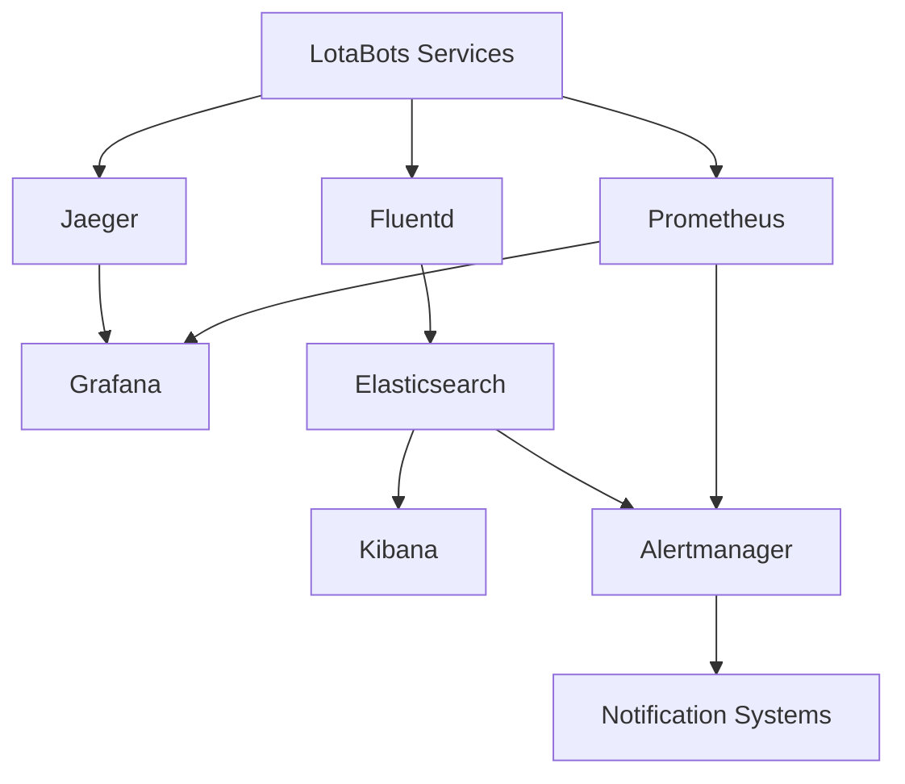

# LotaBots Monitoring Guide

## Overview

This guide details the monitoring and observability setup for the LotaBots platform, including metrics collection, logging, tracing, and alerting configurations.

## Table of Contents
- [Monitoring Architecture](#monitoring-architecture)
- [Metrics Collection](#metrics-collection)
- [Logging System](#logging-system)
- [Distributed Tracing](#distributed-tracing)
- [Alerting](#alerting)
- [Dashboards](#dashboards)
- [Troubleshooting](#troubleshooting)

## Monitoring Architecture

### High-Level Overview



### Component Roles

1. **Metrics Collection**
   - Prometheus: Time-series metrics
   - Node Exporter: System metrics
   - Custom exporters: Business metrics

2. **Log Aggregation**
   - Fluentd: Collection and forwarding
   - Elasticsearch: Storage and search
   - Kibana: Visualization

3. **Distributed Tracing**
   - OpenTelemetry: Instrumentation
   - Jaeger: Trace collection and visualization

## Metrics Collection

### Prometheus Configuration

```yaml
# prometheus.yml
global:
  scrape_interval: 15s
  evaluation_interval: 15s

rule_files:
  - "rules/recording_rules.yml"
  - "rules/alerting_rules.yml"

scrape_configs:
  - job_name: 'lotabots-services'
    metrics_path: '/metrics'
    static_configs:
      - targets:
        - 'api-gateway:8080'
        - 'auth-service:8081'
        - 'attestation-service:8082'
    relabel_configs:
      - source_labels: [__address__]
        target_label: instance
        regex: '([^:]+)(?::\\d+)?'
        replacement: '${1}'

  - job_name: 'node-metrics'
    static_configs:
      - targets:
        - 'node-exporter:9100'

  - job_name: 'postgres-metrics'
    static_configs:
      - targets:
        - 'postgres-exporter:9187'
```

### Recording Rules

```yaml
# recording_rules.yml
groups:
  - name: lotabots_slos
    rules:
      - record: job:request_latency_seconds:mean5m
        expr: |
          rate(http_request_duration_seconds_sum[5m])
          /
          rate(http_request_duration_seconds_count[5m])

      - record: job:request_errors:ratio5m
        expr: |
          sum(rate(http_requests_total{status=~"5.."}[5m]))
          /
          sum(rate(http_requests_total[5m]))

  - name: lotabots_resources
    rules:
      - record: instance:cpu_usage:percent
        expr: 100 - (avg by (instance) (rate(node_cpu_seconds_total{mode="idle"}[5m])) * 100)

      - record: instance:memory_usage:percent
        expr: |
          (
            node_memory_MemTotal_bytes - node_memory_MemAvailable_bytes
          ) / node_memory_MemTotal_bytes * 100
```

## Logging System

### Fluentd Configuration

```yaml
# fluentd.conf
<source>
  @type forward
  port 24224
  bind 0.0.0.0
</source>

<filter **>
  @type record_transformer
  <record>
    hostname "#{Socket.gethostname}"
    tag ${tag}
    time ${time}
  </record>
</filter>

<match **>
  @type elasticsearch
  host elasticsearch
  port 9200
  logstash_format true
  logstash_prefix lotabots
  include_tag_key true
  type_name access_log
  tag_key @log_name
  flush_interval 1s
</match>
```

### Log Format

```json
{
  "timestamp": "2024-03-15T10:30:00Z",
  "level": "INFO",
  "service": "api-gateway",
  "trace_id": "1234567890abcdef",
  "span_id": "abcdef1234567890",
  "request_id": "req-123-456",
  "method": "POST",
  "path": "/api/v1/documents",
  "status": 200,
  "duration_ms": 150,
  "user_id": "user-123",
  "message": "Request processed successfully"
}
```

## Distributed Tracing

### OpenTelemetry Configuration

```yaml
# otel-collector.yaml
receivers:
  otlp:
    protocols:
      grpc:
        endpoint: 0.0.0.0:4317
      http:
        endpoint: 0.0.0.0:4318

processors:
  batch:
    timeout: 1s
    send_batch_size: 1024

exporters:
  jaeger:
    endpoint: jaeger:14250
    tls:
      insecure: true

service:
  pipelines:
    traces:
      receivers: [otlp]
      processors: [batch]
      exporters: [jaeger]
```

### Trace Sampling

```yaml
# sampling.yaml
sampling:
  default_strategy:
    type: probabilistic
    param: 0.1  # 10% sampling rate

  service_strategies:
    - service: api-gateway
      type: probabilistic
      param: 0.5  # 50% sampling for API Gateway

    - service: auth-service
      type: probabilistic
      param: 1.0  # 100% sampling for auth service
```

## Alerting

### Alerting Rules

```yaml
# alerting_rules.yml
groups:
  - name: availability
    rules:
      - alert: HighErrorRate
        expr: job:request_errors:ratio5m > 0.05
        for: 5m
        labels:
          severity: critical
        annotations:
          summary: High error rate detected
          description: Error rate is above 5% for 5 minutes

      - alert: SlowResponses
        expr: job:request_latency_seconds:mean5m > 0.5
        for: 5m
        labels:
          severity: warning
        annotations:
          summary: Slow response times detected
          description: Average response time is above 500ms for 5 minutes

  - name: resources
    rules:
      - alert: HighCPUUsage
        expr: instance:cpu_usage:percent > 80
        for: 5m
        labels:
          severity: warning
        annotations:
          summary: High CPU usage detected
          description: CPU usage is above 80% for 5 minutes

      - alert: HighMemoryUsage
        expr: instance:memory_usage:percent > 85
        for: 5m
        labels:
          severity: warning
        annotations:
          summary: High memory usage detected
          description: Memory usage is above 85% for 5 minutes
```

### Alertmanager Configuration

```yaml
# alertmanager.yml
global:
  resolve_timeout: 5m
  slack_api_url: 'https://hooks.slack.com/services/xxx/yyy/zzz'

route:
  group_by: ['alertname', 'service']
  group_wait: 30s
  group_interval: 5m
  repeat_interval: 4h
  receiver: 'slack-notifications'
  routes:
    - match:
        severity: critical
      receiver: 'pagerduty-critical'
      repeat_interval: 1h

receivers:
  - name: 'slack-notifications'
    slack_configs:
      - channel: '#alerts'
        send_resolved: true
        title: '{{ template "slack.title" . }}'
        text: '{{ template "slack.text" . }}'

  - name: 'pagerduty-critical'
    pagerduty_configs:
      - service_key: '<pagerduty-service-key>'
        send_resolved: true
```

## Dashboards

### Service Overview Dashboard

```json
{
  "dashboard": {
    "title": "LotaBots Service Overview",
    "panels": [
      {
        "title": "Request Rate",
        "type": "graph",
        "targets": [
          {
            "expr": "sum(rate(http_requests_total[5m])) by (service)"
          }
        ]
      },
      {
        "title": "Error Rate",
        "type": "graph",
        "targets": [
          {
            "expr": "job:request_errors:ratio5m"
          }
        ]
      },
      {
        "title": "Response Time",
        "type": "graph",
        "targets": [
          {
            "expr": "job:request_latency_seconds:mean5m"
          }
        ]
      }
    ]
  }
}
```

### Resource Usage Dashboard

```json
{
  "dashboard": {
    "title": "LotaBots Resource Usage",
    "panels": [
      {
        "title": "CPU Usage",
        "type": "graph",
        "targets": [
          {
            "expr": "instance:cpu_usage:percent"
          }
        ]
      },
      {
        "title": "Memory Usage",
        "type": "graph",
        "targets": [
          {
            "expr": "instance:memory_usage:percent"
          }
        ]
      },
      {
        "title": "Network I/O",
        "type": "graph",
        "targets": [
          {
            "expr": "rate(node_network_transmit_bytes_total[5m])"
          },
          {
            "expr": "rate(node_network_receive_bytes_total[5m])"
          }
        ]
      }
    ]
  }
}
```

## Troubleshooting

### Common Issues

#### High Latency Investigation
```bash
# Check service latency
curl -s 'http://prometheus:9090/api/v1/query' --data-urlencode 'query=rate(http_request_duration_seconds_sum[5m])/rate(http_request_duration_seconds_count[5m])' | jq

# Check resource usage
curl -s 'http://prometheus:9090/api/v1/query' --data-urlencode 'query=instance:cpu_usage:percent' | jq

# View recent logs
curl -s 'http://elasticsearch:9200/lotabots-*/_search' -H 'Content-Type: application/json' -d '{
  "query": {
    "range": {
      "timestamp": {
        "gte": "now-5m"
      }
    }
  },
  "sort": [
    {
      "timestamp": "desc"
    }
  ]
}'
```

#### Error Rate Spikes
```bash
# Check error distribution
curl -s 'http://prometheus:9090/api/v1/query' --data-urlencode 'query=sum(rate(http_requests_total{status=~"5.."}[5m])) by (status)' | jq

# View error logs
curl -s 'http://elasticsearch:9200/lotabots-*/_search' -H 'Content-Type: application/json' -d '{
  "query": {
    "bool": {
      "must": [
        {
          "range": {
            "timestamp": {
              "gte": "now-5m"
            }
          }
        },
        {
          "range": {
            "status": {
              "gte": 500
            }
          }
        }
      ]
    }
  }
}'
```

### Useful Commands

```bash
# Check Prometheus targets
curl -s http://prometheus:9090/api/v1/targets | jq

# Check alert status
curl -s http://alertmanager:9093/api/v2/alerts | jq

# Check service health
for service in api-gateway auth-service attestation-service; do
  curl -s http://$service:8080/health
done

# View recent traces
curl -s http://jaeger:16686/api/traces?service=api-gateway&limit=20 | jq
```
