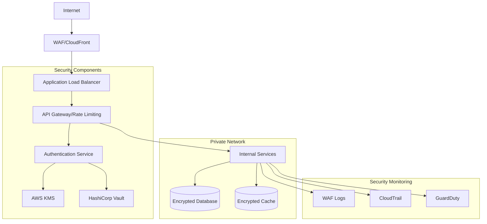
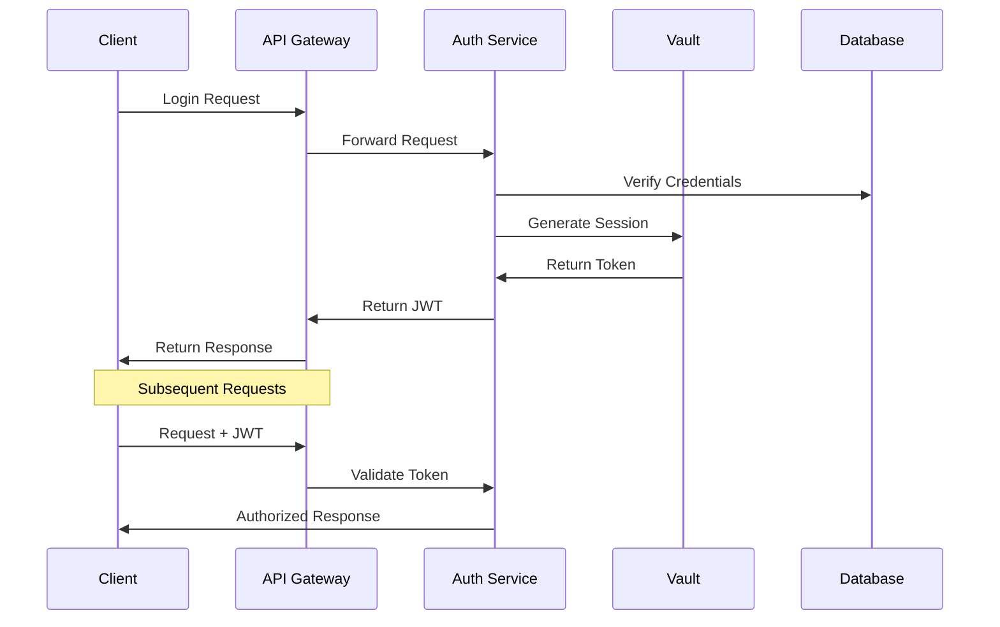
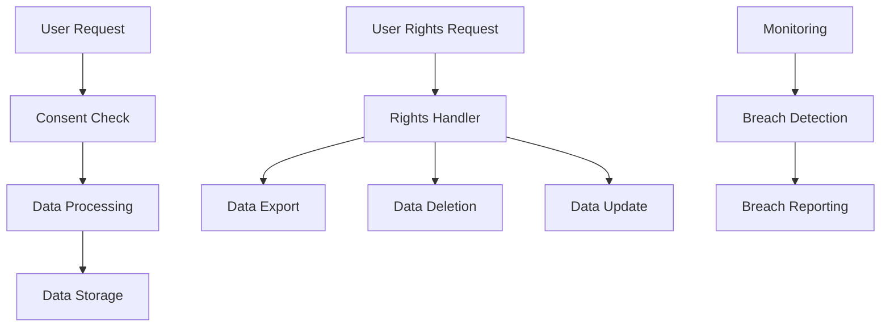

# LotaBots Security Guide

## Overview

This guide details the security architecture, measures, and best practices implemented in the LotaBots platform to ensure data protection, secure access, and compliance with security standards.

## Table of Contents
- [Security Architecture](#security-architecture)
- [Authentication & Authorization](#authentication--authorization)
- [Data Protection](#data-protection)
- [Network Security](#network-security)
- [Security Monitoring](#security-monitoring)
- [Compliance](#compliance)
- [Security Best Practices](#security-best-practices)

## Security Architecture

### High-Level Security Overview



### Security Layers

1. **Edge Security**
   - AWS WAF rules
   - DDoS protection
   - TLS termination

2. **Application Security**
   - JWT-based authentication
   - Role-based access control
   - Input validation
   - Rate limiting

3. **Data Security**
   - Encryption at rest
   - Encryption in transit
   - Key rotation
   - Secure secrets management

## Authentication & Authorization

### Authentication Flow



### JWT Configuration
```yaml
# JWT Settings
jwt:
  algorithm: RS256
  expiry: 1h
  refresh_expiry: 24h
  issuer: "lotabots.com"
  audience: "lotabots-api"

  # Key rotation
  key_rotation_period: 24h
  key_grace_period: 1h
```

### RBAC Configuration
```yaml
# Role definitions
roles:
  admin:
    - "user:*"
    - "document:*"
    - "attestation:*"

  user:
    - "document:read"
    - "document:write"
    - "attestation:submit"

  readonly:
    - "document:read"
    - "attestation:read"
```

## Data Protection

### Encryption Configuration

```yaml
# Database Encryption
database_encryption:
  provider: "aws-kms"
  key_id: "arn:aws:kms:region:account:key/id"
  algorithm: "AES-256-GCM"
  key_rotation: true
  rotation_period: "90d"

# Application-Level Encryption
app_encryption:
  sensitive_fields:
    - "user.password"
    - "document.content"
    - "attestation.results"
  hash_algorithm: "Argon2id"
  hash_parameters:
    memory: 65536
    iterations: 3
    parallelism: 4
```

### Data Classification
```yaml
# Data classification levels
classification:
  public:
    - "user.name"
    - "document.title"

  internal:
    - "document.metadata"
    - "attestation.summary"

  confidential:
    - "user.email"
    - "document.content"
    - "attestation.details"

  restricted:
    - "user.password"
    - "security.keys"
    - "attestation.results"
```

## Network Security

### Network Policies

```yaml
# Kubernetes Network Policy
apiVersion: networking.k8s.io/v1
kind: NetworkPolicy
metadata:
  name: api-gateway-policy
  namespace: lotabots
spec:
  podSelector:
    matchLabels:
      app: api-gateway
  policyTypes:
  - Ingress
  - Egress
  ingress:
  - from:
    - namespaceSelector:
        matchLabels:
          name: ingress-nginx
    ports:
    - protocol: TCP
      port: 8080
  egress:
  - to:
    - podSelector:
        matchLabels:
          app: auth-service
    ports:
    - protocol: TCP
      port: 8081
```

### WAF Rules
```yaml
# AWS WAF Rules
waf_rules:
  rate_based:
    - name: "IP-based rate limiting"
      limit: 2000
      time_window: 5m

  managed_rules:
    - name: "AWSManagedRulesCommonRuleSet"
      override: false
    - name: "AWSManagedRulesKnownBadInputsRuleSet"
      override: false

  custom_rules:
    - name: "Block suspicious patterns"
      conditions:
        - field: "uri"
          pattern: "(?:/\\.\\.|/\\./)"
        - field: "query_string"
          pattern: "(?:exec|system|select.*from)"
```

## Security Monitoring

### Logging Configuration
```yaml
# Logging settings
logging:
  level: INFO
  sensitive_fields:
    - "password"
    - "token"
    - "key"

  retention:
    application: 90d
    security: 365d
    audit: 730d

  destinations:
    - type: "elasticsearch"
      index: "lotabots-logs"
    - type: "cloudwatch"
      group: "/lotabots/production"
```

### Security Alerts
```yaml
# Alerting rules
alerts:
  authentication:
    - name: "Failed login attempts"
      condition: "count > 10 in 5m"
      severity: "warning"

    - name: "Brute force attempt"
      condition: "count > 50 in 5m"
      severity: "critical"

  authorization:
    - name: "Unauthorized access attempt"
      condition: "count > 5 in 1m"
      severity: "warning"

  data_access:
    - name: "Sensitive data access"
      condition: "count > 100 in 1h"
      severity: "warning"
```

## Compliance

### GDPR Compliance



### SOC2 Controls
```yaml
# SOC2 control implementation
soc2_controls:
  access_control:
    - name: "AC-1"
      description: "Access Control Policy"
      implementation:
        - "RBAC implementation"
        - "Regular access reviews"
        - "Automated deprovisioning"

  change_management:
    - name: "CM-1"
      description: "Change Management Policy"
      implementation:
        - "Git-based version control"
        - "PR review requirements"
        - "Automated testing"

  risk_assessment:
    - name: "RA-1"
      description: "Risk Assessment Policy"
      implementation:
        - "Regular security scans"
        - "Vulnerability assessments"
        - "Penetration testing"
```

## Security Best Practices

### Code Security
```yaml
# Security checks in CI/CD
security_checks:
  static_analysis:
    - tool: "cargo audit"
      frequency: "daily"
    - tool: "SonarQube"
      frequency: "on-commit"

  dependency_scanning:
    - tool: "cargo deny"
      frequency: "on-commit"
    - tool: "Snyk"
      frequency: "daily"

  container_scanning:
    - tool: "Trivy"
      frequency: "on-build"
    - tool: "Clair"
      frequency: "daily"
```

### Secret Management
```yaml
# Vault configuration
vault:
  auth_methods:
    - type: "kubernetes"
      path: "kubernetes"
      config:
        role: "lotabots-service"

  secret_engines:
    - type: "kv-v2"
      path: "lotabots"
      config:
        max_versions: 5

  policies:
    - name: "service-policy"
      rules: |
        path "lotabots/data/{{identity.entity.aliases.auth_kubernetes_cluster_name}}" {
          capabilities = ["read"]
        }
```

### Security Hardening
```yaml
# Container security
security_context:
  runAsUser: 1000
  runAsGroup: 1000
  fsGroup: 1000
  capabilities:
    drop: ["ALL"]
  readOnlyRootFilesystem: true
  allowPrivilegeEscalation: false

# Pod security
pod_security_policy:
  spec:
    privileged: false
    allowPrivilegeEscalation: false
    readOnlyRootFilesystem: true
    runAsUser:
      rule: "MustRunAsNonRoot"
    seLinux:
      rule: "RunAsAny"
    supplementalGroups:
      rule: "MustRunAs"
      ranges:
        - min: 1
          max: 65535
```
