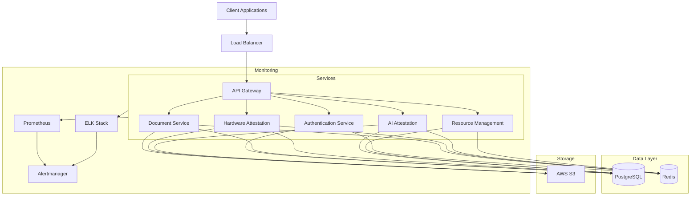
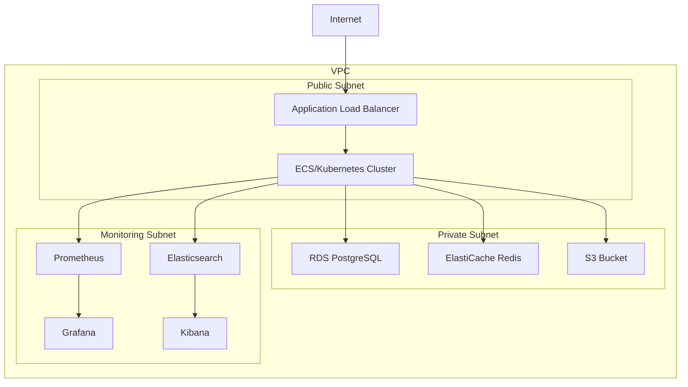
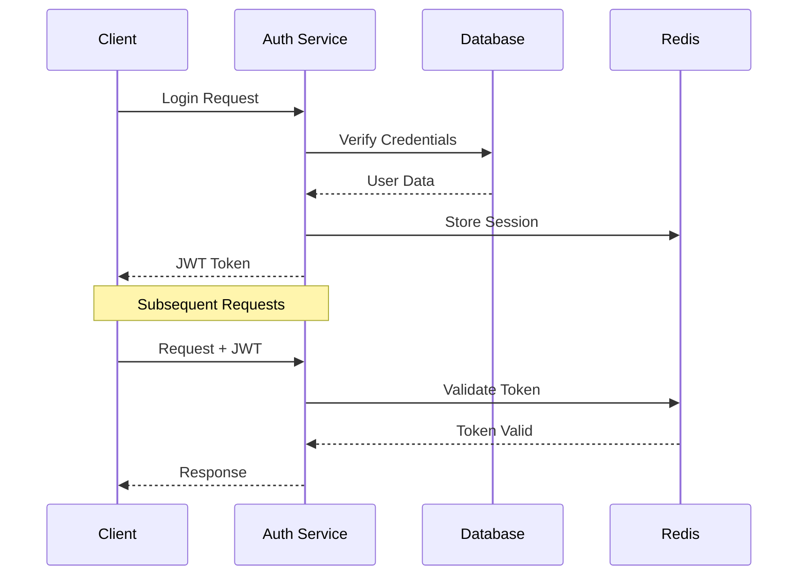
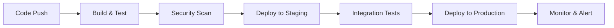
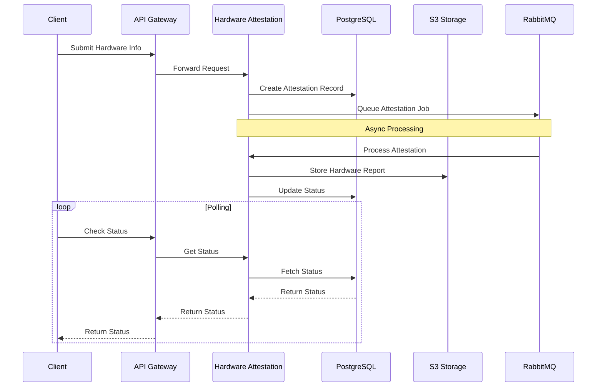
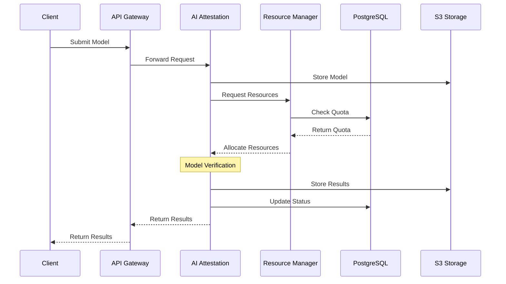

# LotaBots Technology Stack

## Overview

LotaBots is built using modern, high-performance technologies with a focus on security, reliability, and scalability. This document outlines the complete technology stack used across different components of the platform.

## Architecture Overview

### High-Level Architecture



### Deployment Architecture (AWS)



## Core Technologies

### Backend Framework
- **Language**: Rust (Edition 2021)
  - **Why Rust**: Chosen for its memory safety, performance, and robust concurrency model
  - **Key Benefits**:
    - Zero-cost abstractions
    - Thread safety guarantees
    - Excellent tooling and package management
    - Strong type system

- **Web Framework**: Actix-web 4.4
  - **Why Actix**: Selected for its high performance and mature ecosystem
  - **Key Features**:
    - Async-first design
    - Built on Tokio runtime
    - Excellent middleware system
    - Strong security defaults

### Database & Storage
- **Primary Database**: PostgreSQL 14.2
  - **Why PostgreSQL**:
    - ACID compliance
    - Advanced JSON/JSONB support
    - Robust replication
    - Excellent performance
  - **Configuration**:
    ```ini
    max_connections = 100
    shared_buffers = 4GB
    effective_cache_size = 12GB
    maintenance_work_mem = 1GB
    checkpoint_completion_target = 0.9
    wal_buffers = 16MB
    default_statistics_target = 100
    random_page_cost = 1.1
    effective_io_concurrency = 200
    work_mem = 41943kB
    ```

- **Caching Layer**: Redis 6.2
  - **Why Redis**:
    - Ultra-fast performance
    - Rich data structures
    - Built-in replication
    - Persistence options
  - **Configuration**:
    ```ini
    maxmemory 4gb
    maxmemory-policy allkeys-lru
    appendonly yes
    appendfsync everysec
    ```

### Inter-Service Communication

#### REST APIs
- Internal service communication uses RESTful APIs
- OpenAPI 3.0 specification for all endpoints
- Rate limiting and circuit breaking

#### Message Queue (Optional)
- RabbitMQ for asynchronous operations
- Used for:
  - Long-running attestation tasks
  - Notification delivery
  - Event logging

## State Management

### Database State
- Primary source of truth
- Transactional consistency
- Optimistic locking for concurrent updates

### Cache State
- TTL-based invalidation
- Write-through caching
- Cache-aside for specific queries

### Session State
- JWT tokens for authentication
- Redis for rate limiting
- Distributed session management

## Monitoring and Observability

### Metrics Collection
- **Prometheus Metrics**:
  ```
  # Request Metrics
  http_requests_total{method="GET", endpoint="/api/v1/documents"}
  http_request_duration_seconds{method="GET", endpoint="/api/v1/documents"}

  # Resource Metrics
  process_cpu_seconds_total
  process_resident_memory_bytes

  # Business Metrics
  attestation_requests_total{type="hardware|ai"}
  attestation_success_rate{type="hardware|ai"}
  ```

### Log Aggregation (ELK Stack)
- **Elasticsearch**:
  - Document-based storage
  - Full-text search
  - Real-time analytics

- **Logstash**:
  - Log ingestion and transformation
  - Custom filters and enrichment
  - Multiple output destinations

- **Kibana**:
  - Log visualization
  - Custom dashboards
  - Alerting integration

### Distributed Tracing
- OpenTelemetry instrumentation
- Trace sampling rate: 10%
- Retention period: 7 days
- Custom span attributes for business context

## Security Architecture

### Authentication Flow



### Encryption
- **In Transit**:
  - TLS 1.3
  - Perfect Forward Secrecy
  - Strong cipher suites

- **At Rest**:
  - AES-256 encryption
  - Key rotation every 90 days
  - AWS KMS integration

## Performance Benchmarks

### API Performance (under load)
```
Endpoint          Avg (ms)    p95 (ms)    p99 (ms)    RPS
/auth/login         45         75          120         500
/documents          35         60          90          1000
/attestation        150        250         350         200
```

### Database Performance
```
Query Type         Avg (ms)    p95 (ms)    Cache Hit %
Simple Select        2          5           95%
Complex Join        15          30          80%
Write Operation     10          20          N/A
```

## Deployment Process

### CI/CD Pipeline



### Release Strategy
1. **Development**:
   - Feature branches
   - PR reviews
   - Automated tests

2. **Staging**:
   - Integration testing
   - Performance testing
   - Security scanning

3. **Production**:
   - Blue-green deployment
   - Automated rollback
   - Health monitoring

## Compliance Implementation

### GDPR Compliance
- Data encryption
- User consent management
- Data export capability
- Right to be forgotten implementation

### SOC2 Compliance
- Access control matrix
- Audit logging
- Security monitoring
- Incident response procedures

## Future Technology Roadmap

### Short Term (0-6 months)
- Upgrade to PostgreSQL 15
- Implement GraphQL API
- Enhanced monitoring

### Long Term (6-12 months)
- gRPC adoption
- Event sourcing
- Machine learning pipeline

## Key Workflow Diagrams

### Hardware Attestation Flow



### AI Model Verification Flow



## Component Configurations

### API Gateway Configuration
```yaml
rate_limiting:
  window_size: 60s
  max_requests: 1000
  burst_size: 50

routing:
  timeout: 30s
  retry_attempts: 3
  circuit_breaker:
    failure_threshold: 5
    reset_timeout: 60s

cors:
  allowed_origins: ["https://*.lotabots.com"]
  allowed_methods: ["GET", "POST", "PUT", "DELETE"]
  max_age: 3600
```

### Prometheus Configuration
```yaml
global:
  scrape_interval: 15s
  evaluation_interval: 15s

scrape_configs:
  - job_name: 'lotabots-services'
    metrics_path: '/metrics'
    static_configs:
      - targets: ['api:8080', 'auth:8081', 'attestation:8082']

  - job_name: 'node-exporter'
    static_configs:
      - targets: ['node-exporter:9100']

recording_rules:
  groups:
    - name: service_slos
      rules:
        - record: job:request_latency_seconds:mean5m
          expr: rate(http_request_duration_seconds_sum[5m]) / rate(http_request_duration_seconds_count[5m])
```

### Alertmanager Configuration
```yaml
route:
  group_by: ['alertname', 'service']
  group_wait: 30s
  group_interval: 5m
  repeat_interval: 4h
  receiver: 'ops-team'

receivers:
  - name: 'ops-team'
    slack_configs:
      - channel: '#alerts'
        send_resolved: true
    pagerduty_configs:
      - service_key: '<key>'
        severity: 'critical'
```

## Extended Performance Benchmarks

### Service Performance Metrics

```
Service         CPU Usage    Memory Usage    Error Rate    Req/sec
API Gateway     25-35%      2-3GB           0.01%         2000
Auth Service    15-25%      1-2GB           0.005%        500
Hardware Att.   40-60%      4-6GB           0.02%         200
AI Attestation  70-85%      8-12GB          0.03%         100
Resource Mgmt   20-30%      2-3GB           0.01%         300

Environment: AWS t3.xlarge instances (4 vCPU, 16GB RAM)
Test Duration: 24 hours
Concurrent Users: 1000
```

### Database Performance Details

```
Query Type            Avg (ms)    p95 (ms)    p99 (ms)    TPS     Lock Time (ms)
Simple Select         2           5           10          1000    0.1
Complex Join         15          30          50          200     0.5
Write Operation      10          20          35          500     1.0
Bulk Insert (1000)   200         350         500         10      5.0

Database: PostgreSQL 14.2 on AWS RDS r5.xlarge
Dataset Size: 500GB
Connection Pool: 50-100 connections
```

### Cache Performance Metrics

```
Operation Type    Hit Rate    Avg Latency    Memory Usage    Eviction Rate
API Responses     95%         0.5ms          2GB             0.01%
Session Data     98%         0.3ms          1GB             0.005%
User Profiles    90%         0.4ms          3GB             0.02%

Cache: Redis 6.2 on ElastiCache r5.large
Total Memory: 8GB
Eviction Policy: allkeys-lru
```

### Network Performance

```
Path                        Latency    Bandwidth    Packet Loss
Client → API Gateway        50ms       100Mbps      0.001%
Inter-Service (same AZ)     2ms        1Gbps        0.0001%
Service → Database          5ms        500Mbps      0.0001%
Service → Cache            1ms        750Mbps      0.0001%

Network: AWS VPC with Enhanced Networking
Region: us-west-2
Availability Zones: 3
```
