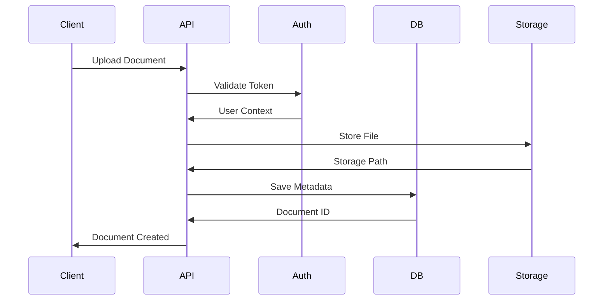

# Document Automation Service Architecture

## Overview

The Document Automation Service is a microservice designed to handle document processing workflows, including storage, OCR, classification, and automated processing. The service is built with Rust using modern async/await patterns and follows a modular architecture.

## Core Components

### 1. API Layer (`src/api/`)

- RESTful endpoints using Axum framework
- JWT-based authentication
- Role-based access control
- Request validation and error handling

### 2. Storage Layer (`src/storage/`)

- Abstract `StorageBackend` trait
- Multiple implementations:
  - S3 storage for production
  - Local filesystem for development
  - GCS (planned)
- Secure file handling with encryption

### 3. Database Layer (`src/db/`)

- PostgreSQL with async-sqlx
- Document metadata storage
- Workflow state management
- Optimized queries with indexes

### 4. Authentication (`src/auth/`)

- JWT token generation and validation
- Role-based middleware
- User context management
- Security best practices

### 5. Core Types (`src/core/`)

- Error types and handling
- Configuration management
- Common utilities
- Type definitions

### 6. Models (`src/models/`)

- Document data structures
- Workflow definitions
- Serialization/deserialization
- Database mappings

## Data Flow



## Security Architecture

1. **Authentication**

   - JWT tokens with expiration
   - Secure token generation
   - Role-based access control

2. **Data Security**

   - Encryption at rest
   - TLS in transit
   - Document access control

3. **Infrastructure**
   - Secure storage backends
   - Database security
   - Network isolation

## Database Schema

### Documents Table

```sql
CREATE TABLE documents (
    id UUID PRIMARY KEY,
    name VARCHAR(255),
    content_type VARCHAR(255),
    size BIGINT,
    storage_path TEXT,
    status document_status,
    classification document_classification,
    security_level security_level,
    author VARCHAR(255),
    tags TEXT[],
    custom_fields JSONB,
    created_at TIMESTAMPTZ,
    updated_at TIMESTAMPTZ
);
```

### Workflows Table

```sql
CREATE TABLE workflows (
    id UUID PRIMARY KEY,
    name VARCHAR(255),
    description TEXT,
    status workflow_status,
    creator VARCHAR(255),
    tags TEXT[],
    document_types TEXT[],
    required_approvals TEXT[],
    created_at TIMESTAMPTZ,
    updated_at TIMESTAMPTZ
);
```

## Configuration

The service uses a layered configuration approach:

1. Default configuration files
2. Environment-specific overrides
3. Environment variables
4. Command-line arguments (planned)

Example configuration (TOML):

```toml
[server]
host = "127.0.0.1"
port = 8080
workers = 4

[storage]
provider = "s3"
bucket = "documents"
region = "us-east-1"

[security]
jwt_secret = "..."
token_expiration = 24
```

## Error Handling

The service uses a custom error type (`DocumentError`) that:

- Maps to appropriate HTTP status codes
- Provides structured error responses
- Includes error context and debugging info
- Handles different error categories (validation, storage, etc.)

## Monitoring & Observability

1. **Logging**

   - Structured logging with tracing
   - Log levels for different environments
   - Request/response logging
   - Error tracking

2. **Metrics**

   - Document upload/download counts
   - Processing times
   - Error rates
   - Storage usage

3. **Tracing**
   - Request tracing
   - Performance monitoring
   - Dependency tracking

## Development Setup

1. **Prerequisites**

   ```bash
   # Install Rust
   curl --proto '=https' --tlsv1.2 -sSf https://sh.rustup.rs | sh

   # Install PostgreSQL
   sudo apt-get install postgresql postgresql-contrib

   # Install development dependencies
   sudo apt-get install build-essential pkg-config libssl-dev
   ```

2. **Database Setup**

   ```bash
   # Create database
   createdb docautomation

   # Run migrations
   sqlx migrate run
   ```

3. **Configuration**

   ```bash
   # Copy example config
   cp config/default.example.toml config/default.toml

   # Edit configuration
   nano config/default.toml
   ```

4. **Running the Service**

   ```bash
   # Development
   cargo run

   # Production
   cargo run --release
   ```

## Testing Strategy

1. **Unit Tests**

   - Individual component testing
   - Mocked dependencies
   - Error case coverage

2. **Integration Tests**

   - API endpoint testing
   - Database operations
   - Storage operations

3. **Performance Tests**
   - Load testing
   - Concurrency testing
   - Resource usage monitoring

## Deployment

The service can be deployed using:

1. Docker containers
2. Kubernetes (with provided manifests)
3. Bare metal servers
4. Cloud platforms (AWS, GCP)

## Future Enhancements

1. **Features**

   - Advanced OCR processing
   - Machine learning classification
   - Workflow automation
   - Real-time notifications

2. **Technical**

   - GraphQL API
   - WebSocket support
   - Caching layer
   - Rate limiting

3. **Security**
   - OAuth2 integration
   - Audit logging
   - Enhanced encryption
